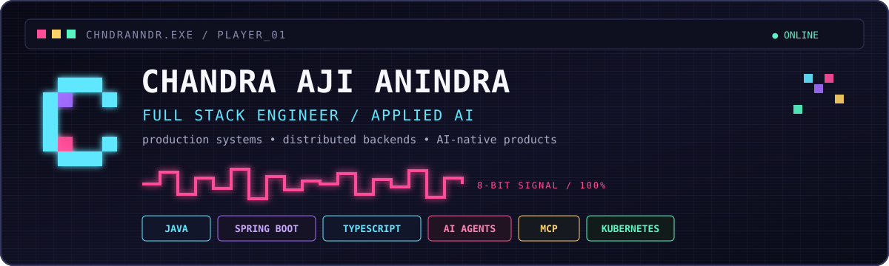

<p align="center">
  
</p>

<p align="center">
  <a href="https://chndranndr.github.io/"><b>PORTFOLIO</b></a>
  &nbsp;·&nbsp;
  <a href="https://github.com/chndranndr?tab=repositories"><b>REPOSITORIES</b></a>
  &nbsp;·&nbsp;
  <a href="#03--featured-tracks"><b>FEATURED BUILDS</b></a>
</p>

```text
┌─ NOW PLAYING ───────────────────────────────────────────────────────┐
│ ROLE       Senior Full Stack / Applied AI Engineer                 │
│ XP         9+ years shipping production software                   │
│ MAIN       Java · Spring Boot · TypeScript · React                 │
│ SPECIAL    Distributed systems · AI agents · MCP · developer tools │
│ SIDE QUEST Japanese learning tools · Unreal / game development     │
└────────────────────────────────────────────────────────────────────┘
```

## 01 // PLAYER PROFILE

I build production software across **backend, frontend, infrastructure, and AI workflows**. My core background is Java/Spring and distributed systems; more recently I have been building TypeScript products and AI-native tooling around agents, RAG, MCP, and deterministic application workflows.

My default engineering bias: **keep the system understandable, observable, testable, and boring where boring is useful.** Use AI where it adds leverage—not where ordinary code is more reliable.

## 02 // LOADOUT

<table>
<tr>
<td valign="top" width="50%">

**BACKEND / SYSTEMS**

`Java` `Spring Boot` `Scala` `Python`  
`REST` `Microservices` `Kafka` `Redis`  
`PostgreSQL` `MySQL` `Neo4j` `Elasticsearch`

</td>
<td valign="top" width="50%">

**PRODUCT / AI**

`TypeScript` `React` `Node.js`  
`LLM APIs` `AI Agents` `RAG` `MCP`  
`Playwright` `Cypress`

</td>
</tr>
<tr>
<td valign="top">

**PLATFORM**

`Docker` `Kubernetes` `AWS`  
`GitHub Actions` `GitLab CI` `Jenkins`  
`Grafana` `Kibana`

</td>
<td valign="top">

**CURRENT SIGNAL**

`Applied AI Engineering`  
`Agentic developer workflows`  
`Local-first software`  
`Unreal Engine`

</td>
</tr>
</table>

## 03 // FEATURED TRACKS

| Track | What it is | Stack / signal |
| --- | --- | --- |
| **[MERATUS](https://github.com/chndranndr/fire-tracker)** | Geospatial intelligence dashboard for Indonesian wildfire hotspots, FIRMS ingestion, concession overlays, and evidence-separated investigative data. | `Python` `Geospatial` `GitHub Actions` `Data pipelines` |
| **[Job Sequencer](https://github.com/chndranndr/job-sequencer)** | Local-first job-search dashboard with in-process AI workflows and deterministic orchestration around external job sources. | `TypeScript` `Node.js` `Pi SDK` `AI agents` |
| **[NihongoFlow](https://github.com/chndranndr/NihongoFlow)** | Minimal Japanese learning app with kana, kanji, vocabulary, grammar, conversation, and AI-assisted learning features. | `React` `TypeScript` `Gemini` `Capacitor` |
| **[Book Lending](https://github.com/chndranndr/book-lending)** | Self-contained book-lending microservice with authentication, persistence, API docs, and Docker-first execution. | `Java 21` `Spring Boot` `JPA` `SQLite` `Docker` |

## 04 // ENGINEERING MODS

```text
[01] PRODUCTION FIRST     → design for failure, latency, observability, recovery
[02] DETERMINISTIC CORE   → normal code for rules; AI for ambiguity and leverage
[03] DOCS ARE CODE        → architecture decisions and constraints stay explicit
[04] SMALL FEEDBACK LOOPS → tests, evals, CI gates, fast local verification
[05] SHIP > THEATER       → prefer working systems over fashionable abstractions
```

## 05 // SIDE QUESTS

Outside production engineering, I build tools for **Japanese learning**, experiment with **AI-first product workflows**, and study **game development with Unreal Engine**.

```text
♫  chiptune mode: ON
> build something useful
> reduce unnecessary complexity
> repeat
```

<p align="center">
  <sub>CHNDRANNDR // INSERT COIN TO CONTINUE</sub>
</p>
