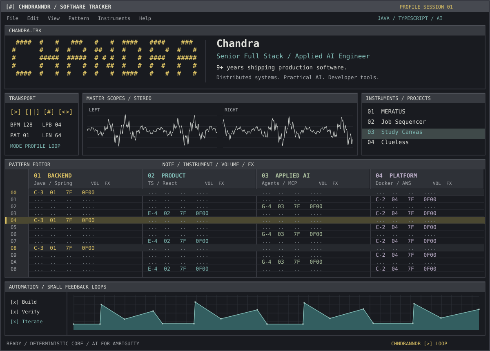

9+ years shipping production software.

[Portfolio](https://chndranndr.github.io/) · [Repositories](https://github.com/chndranndr?tab=repositories) · [Project instruments](#02--project-instruments)

## `01` / CHANDRA.TRK

I build production software across backend, frontend, infrastructure, and AI workflows. My foundation is **Java, Spring Boot, and distributed systems**; my recent work focuses on **TypeScript products and practical AI tooling**.

| Track | Instrument | Stack |
| :--- | :--- | :--- |
| `01` | **Backend** | Java · Spring Boot · Scala · Python · Kafka · Redis |
| `02` | **Frontend** | TypeScript · React · Node.js · Playwright · Cypress |
| `03` | **Applied AI** | Pi SDK · RAG · MCP · LLM APIs |
| `04` | **Platform** | Docker · Kubernetes · AWS · CI/CD · Grafana |

**Data layer:** PostgreSQL · MySQL · Neo4j · Elasticsearch

## `02` / Project instruments

| Slot | Project | Signal |
| :--- | :--- | :--- |
| `01` | **[MERATUS](https://github.com/chndranndr/fire-tracker)** | Indonesian wildfire intelligence: FIRMS ingestion, concession overlays, and investigative data with explicit evidence boundaries. **Python · Geospatial · Data pipelines** |
| `02` | **[Job Sequencer](https://github.com/chndranndr/job-sequencer)** | Local-first job-search dashboard with in-process AI workflows and deterministic orchestration. **TypeScript · Node.js · Pi SDK** |
| `03` | **[Study Canvas](https://github.com/chndranndr/study-canvas)** | Local-first Japanese learning for Android tablets, with a zoomable canvas, stylus handwriting, adaptive practice, and AI tutoring. **Kotlin · Jetpack Compose · Room · Gemini** |
| `04` | **[Clueless](https://github.com/chndranndr/clueless)** | Windows desktop assistant for screen-aware technical help: screen capture, prompts, and streaming answers in an overlay. Development build. **JavaScript · Electron · Pi SDK** |

## `03` / Automation

```text
ROW  EVENT             ACTION
00   PRODUCTION FIRST  Plan for failure, latency, and recovery.
04   DETERMINISM       Code for rules. AI for ambiguity.
08   OBSERVABILITY     Make system behavior inspectable.
0C   DOCUMENTATION     Keep decisions and constraints explicit.
10   FEEDBACK          Build -> test -> evaluate -> iterate.
14   SIMPLICITY        Ship useful software. Cut unnecessary complexity.
```

**Side channels:** Japanese learning tools · Unreal Engine · game development

```text
 [>] LOOP     __|~~~|___|~~~|___|~~~|___     END OF PATTERN
```
